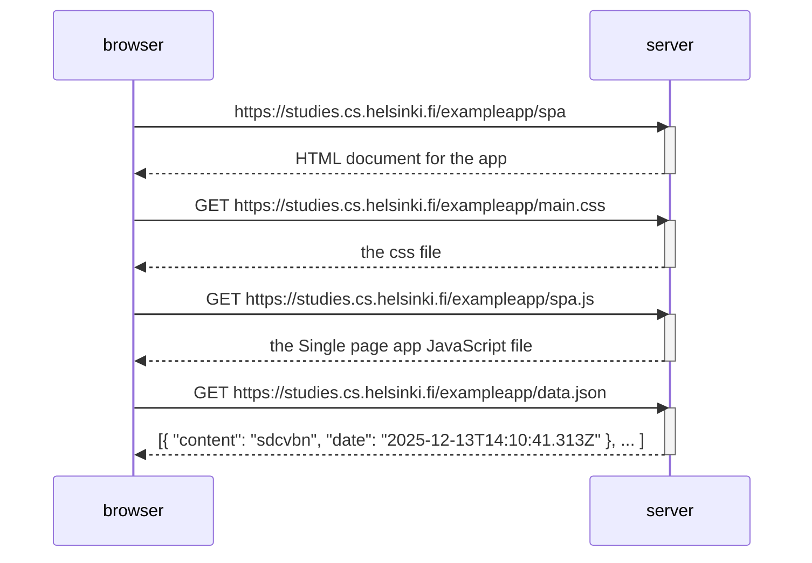

# Single page app opening graph
task 0.5

```mermaid
sequenceDiagram
    participant browser
    participant server

    browser->>server: https://studies.cs.helsinki.fi/exampleapp/spa
    activate server
    server-->>browser: HTML document for the app
    deactivate server

    browser->>server: GET https://studies.cs.helsinki.fi/exampleapp/main.css
    activate server
    server-->>browser: the css file
    deactivate server
    
    browser->>server: GET https://studies.cs.helsinki.fi/exampleapp/spa.js
    activate server
    server-->>browser: the Single page app JavaScript file
    deactivate server
    
    browser->>server: GET https://studies.cs.helsinki.fi/exampleapp/data.json
    activate server
    server-->>browser: [{ "content": "sdcvbn", "date": "2025-12-13T14:10:41.313Z" }, ... ]
    deactivate server
```